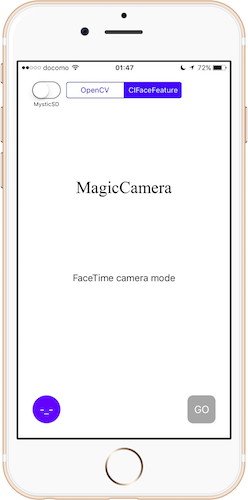

# MagicCamera
  
All automatic camera app that works with MysticSD.  
It can also be used without MysticSD.

## Usage
1. It enables the camera function by MysticSD. (or You push Go Button.)
2. App looks for the face.
3. To start the countdown.
4. Take a photo.
5. To disable the camera function.

Caution:You must launch the app.

## Install
~~1. Create a new project using Xcode. (Name is MagicCamera.)~~  
~~2. Save the contents of the MagicCamera folder.~~  
1. This repository clone  
2. Open project file  
3. It introduces the library. (Using the CocoaPods.)

## Development
AkkeyLab  
HP:akkeylab.com

## Licence
MIT License  
Please read the LICENSE file.